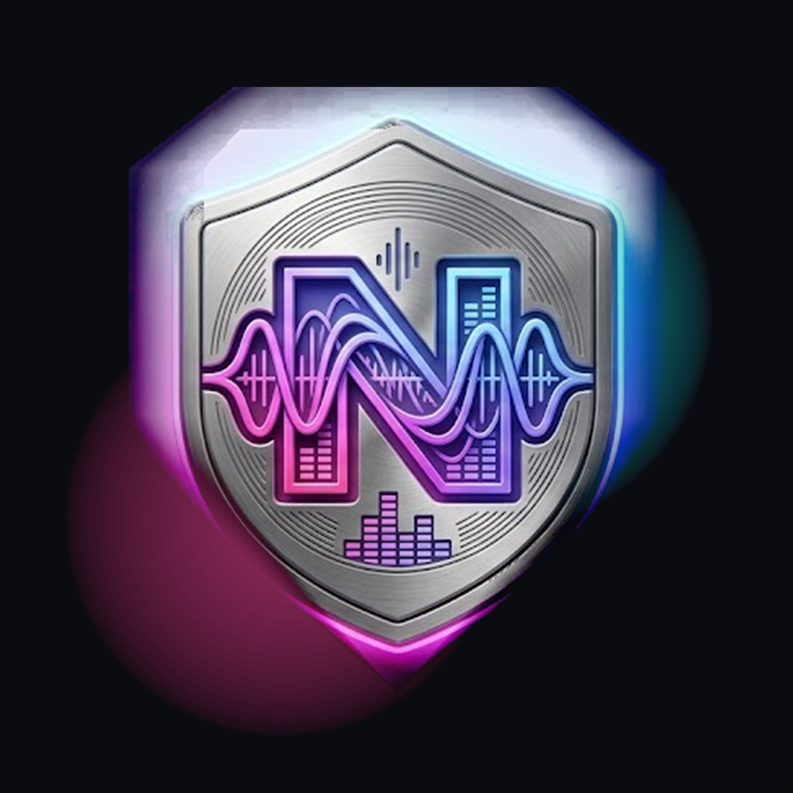

# Nexora Audio Player — Flutter Mobile Client

Production-quality Android + iOS audiophile music player for the self-hosted **Nexora** server.



## Features
- 🔐 **Real server auth** — Bearer JWT, secure storage, refresh, 401 handling
- 🌐 **Self-hosted / LAN** — configurable server URL (`https://…` or `http://192.168.x.x:PORT/api/v1`), test-connection diagnostics
- 📚 **Library** — songs / albums / artists, pagination, artwork, offline cache (sqflite)
- 🔍 **Search** — debounced, cancellable, recent searches, local fallback when offline
- 🎵 **Playback** — `just_audio` + `audio_service` (background, lock screen, Bluetooth, headset)
- 📋 **Queue** — play now / play next / add to queue / reorder / shuffle / repeat / persist & restore
- ❤️ **Playlists, Favorites, History** — optimistic UI + sync queue, server remains source of truth
- 📴 **Offline** — cached library, downloadable tracks, queued mutations, sync on reconnect
- 🎨 **Audiophile UI** — dark immersive theme, glass surfaces, large artwork, quality badges (codec/bitrate/sampleRate only when metadata provides), cassette reel animation
- 🎛️ **Equalizer** — UI for preamp + 8 bands; DSP engine pluggable via platform channels (no fake controls)
- 🔔 **Mini-player + Full player** — persistent mini above bottom nav, immersive full-screen with progress, queue, quality info

## Architecture
See [`docs/architecture.md`](docs/architecture.md) and [`docs/api-contract.md`](docs/api-contract.md).

```
UI → Riverpod → Repository → (ApiClient/Dio → Nexora Server) + (sqflite cache)
                 ↘ SyncManager → retry when online
Audio: just_audio → audio_service → system controls
```

Clean architecture pragmatically — no `Map` in widgets, typed DTOs → entities, isolated API layer.

## Docs
- `docs/api-contract.md` — all endpoints, auth, pagination, errors, examples
- `docs/architecture.md` — structure, layers, audio, offline, tests
- `docs/authentication.md` — token flow, refresh, secure storage
- `docs/playback.md` — engine, queue, background
- `docs/synchronization.md` — offline mutations, sync queue
- `docs/offline-mode.md` — cache TTLs, offline UX
- `docs/development.md` — run/build/test
- `docs/android.md` / `docs/ios.md` — platform setup

## Quick Start

### Prerequisites
- Flutter 3.24+ stable
- Android SDK / Xcode

### Install & Run
```bash
flutter pub get
flutter run
# with custom server (also configurable in-app)
flutter run --dart-define=NEXORA_API_BASE_URL=https://music.example.com/api/v1
# LAN
flutter run --dart-define=NEXORA_API_BASE_URL=http://192.168.1.100:3000/api/v1
```

### Server Setup (in-app)
1. Open **Login → Configure Server**
2. Enter `https://music.example.com` or `192.168.1.100:3000`
3. **Test Connection** → ✓ reachable → **Save & Connect**
4. Log in with Nexora credentials

The app normalizes URLs, stores them securely, and validates via `GET /health` / `GET /api/v1/server/info`.

### Commands
```bash
dart format .
flutter analyze
flutter test
flutter build apk --release
flutter build ios --release --no-codesign
```

## API Contract
The client adapts to the existing Nexora API — it never invents a fake backend.
- Versioned at `/api/v1`, isolates future `/api/v2`
- Paginated envelopes, Bearer auth, refresh, error mapping
- If an endpoint is missing, repository gracefully degrades and documents it

Full spec → [`docs/api-contract.md`](docs/api-contract.md)

## Project Structure
```
lib/
├── core/{config,constants,errors,network,storage,database,audio,download,sync,logging,utils}
├── data/{api,dto,repositories,local}
├── domain/entities
├── features/{auth,home,library,search,playlists,player,equalizer,settings,favorites,history}
├── ui/{theme,widgets}
├── router.dart
└── main.dart
```

## Security
- Tokens in `flutter_secure_storage` (encryptedSharedPrefs / keychain)
- HTTPS in production, no token logging
- No secrets in Git, sanitized logs

## Platform

### Android
- Permissions: INTERNET, FOREGROUND_SERVICE_MEDIA_PLAYBACK, POST_NOTIFICATIONS
- `AudioService` foreground service, notification controls, audio focus

### iOS
- `UIBackgroundModes: audio`, lock-screen via `audio_service`, AVAudioSession `.playback`
- `NSAllowsLocalNetworking` for LAN http

See platform docs for builds.

## Testing
```bash
flutter test
```
- Unit: DTO parsing, `AppConfig.normalizeUrl`, pagination
- Widget: smoke test via `NexoraApp` + handler override
- Integration: login → library → play → queue → playlist → favorite → search → logout (via fake API in tests; no live server required)

## Contributing
Preserve the server as source of truth. Isolate compatibility hacks in `data/`. Keep widgets free of `Dio`.

## License
Private — see `SECURITY.md`.

